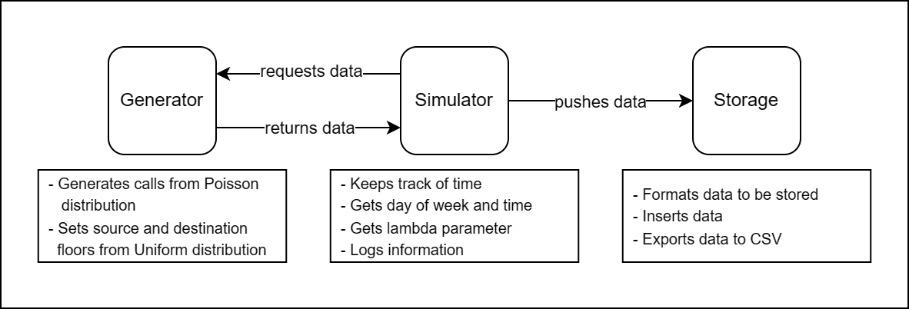

<div align="center">
    <h1>Data Ingestion System for an ML Model to  Predict Optimal Elevator Landing Floors</h1>
</div>

## Introduction

This repository contains the implementation of a data ingestion system that collects and stores data to train an ML model that predicts the next best floor to land for an elevator.

## Proposal

For this system, we hypothesize that the demand of an elevator depends on the day of the week and the time of the day. It's common for people to follow certain routines that are repeated every week.An elevator could use this information to try to predict the next optimal landing floor at a given time.

For this reason, this system will focus on collecting two features: `day of the week` and `time` (in `HHMM` format) of each call. The idea is that an ML model could be trained on these two features and will try to predict the optimal landing floor. This would be the target variable of the ML model.

In our system, we refer to the landing floor as `source floor` (of a call). We also collect the `destination floor` of each call as metadata that could potentially be useful to inform the elevator decisions.

> [!NOTE]
>This system only collects and stores data as a data ingestion system. It doesn't simulate the behavior of the elevator, just because it's not needed for our purposes. Once an ML model is trained with the collected data, we could model the elevator behavior and guide it's direction based on the obtained predictions.

## Design

The implementation can be found in the `src` folder and is composed of three main components:

- `simulator`
- `generator`
- `storage`

We also have two auxiliary modules with some utilities: `constants` and `parameters`.

Let's explain the main components:

**Simulator**:
This is the main component of the system. It's responsible for controlling the time. It receives parameters that users can set, including the number of `floors` in the building, the `start datetime` and `end datetime` of the simulation, and a randomly generated `lambdas table` used by the `generator` component. The simulation operates with a simple `while` loop, incrementing time in discrete steps similar to a discrete event simulation. The step can be defined by the user too. During each iteration, this component calls the `generator` to create elevator calls (demands or requests), which are then sent to the `storage` module.

**Generator**:
This component is responsible for generating the dataset. It is called during each iteration of the simulation. It takes a `lambda` parameter to generate the number of calls based on a Poisson distribution. The `lambda` value varies depending on the day of the week and the hour of the day. We use the `lambdas table` to know which `lambda` value to use at each time. For each call, the module randomly and uniformly selects the source and destination floors for the elevator request. The generated data is then returned to the `simulator`.

**Storage**:
The `storage` component is responsible for inserting the calls collected during each iteration. It consists of a simple `sqlite3` database with a single table named `call`, which stores the information we are interested in. The `day of the week`, `time` (in `HHMM` format), and the `source floor` and `destination floor` of each call. Calls are stored in batches during each iteration using the `executemany` function from `sqlite3`. Below is the schema of the database:

<div align="center">
    <br>
    
    <br><br>
</div>

Here's a diagram describing the architecture of the system:

<div align="center">
    
</div>

## Usage

### Prerequisites

First, make sure you have the following software installed in your system:

1. Install [Python](https://www.python.org/downloads/).
2. Install [Git](https://git-scm.com/downloads).
3. Install [pip](https://pip.pypa.io/en/stable/installation/).
4. Install [virtualenv](https://virtualenv.pypa.io/en/latest/installation.html).

### Setup

1. Clone this repository
2. Navigate to the `devtest` folder
3. [Create](https://docs.python.org/3/library/venv.html) a virtual environment
4. [Activate](https://docs.python.org/3/tutorial/venv.html) the virtual environment.

    - If you are on Windows, run `env\Scripts\activate`.
    - If you are on Linux, run `source env/bin/activate`.

5. Install the dependencies: `pip install -r requirements.txt`.

### Run the tests

From the `devtest` folder, run:

```sh
pytest test/src
```

### Run the program

1. Set the parameters in `src/main.py` file.

    Here's an example of how you could do it:

    ```python
    FLOORS = 5
    START_DATETIME = datetime(2024, 4, 1, 0, 0)
    END_DATETIME = datetime(2024, 4, 2, 23, 59)
    TIME_UNIT_IN_MINUTES = 10
    LAMBDAS = generate_lambda_table(min_lambda=0.0, max_lambda=5.0)
    ```

    This configuration specifies that the building has `5 floors`. The simulation will run from `April 1, 2024, at 12:00 AM` to `April 2, 2024, at 11:59 PM`. Data will be collected every `10 minutes`, with the `lambdas` values representing the average number of calls expected during each 10-minute interval.

    The `lambdas table` is currently generated randomly. You can set the range of possible values by specifying the `min_lambda` and `max_lambda` in the `generate_lambda_table` function. You could also set these values manually if you have specific information for your building. In such cases, ensure that the variable is properly formatted as a nested dictionary of type `dict[str, dict[str, float]]`. This dictionary should include entries for all days of the week, with each day containing hourly lambda values from `"00"` to `"23"`.

2. Navigate to the `src` folder and run:

    ```sh
    py main.py
    ```

    If you want to reset the database, and start with a fresh new one, run:

    ```sh
    py main.py --reset
    ```

3. The collected data will be exported to a `csv` file containing the `day of the week` (as an integer), the `time` (in `HHMM` integer format), the `source floor` and the `destination floor`, ready to be used to train an ML model. You could also connect your ML model to the database directly instead of using the exported `csv` data.

## Technical Details

### Programming Languages

- **Python**

### Dependencies

- `numpy`
- `pytest`

For a comprehensive list of dependencies, including both direct and transitive
dependencies, please refer to the `requirements.txt` file.
